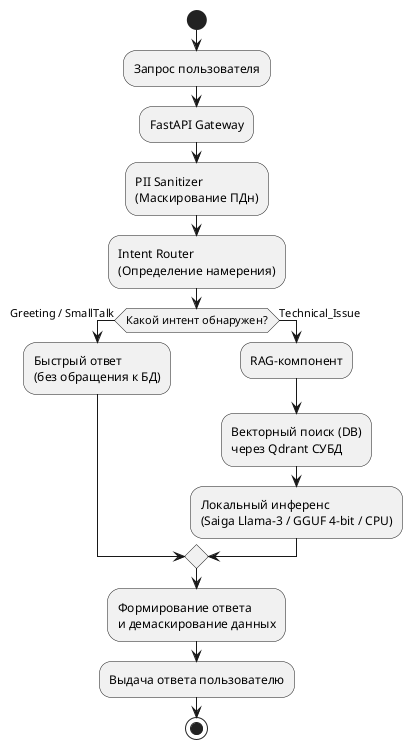
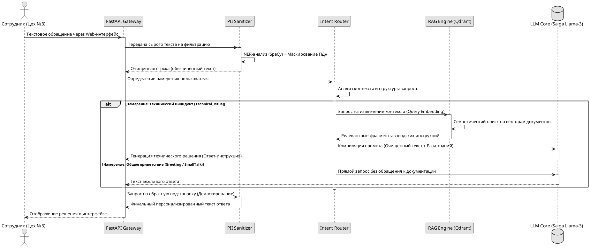
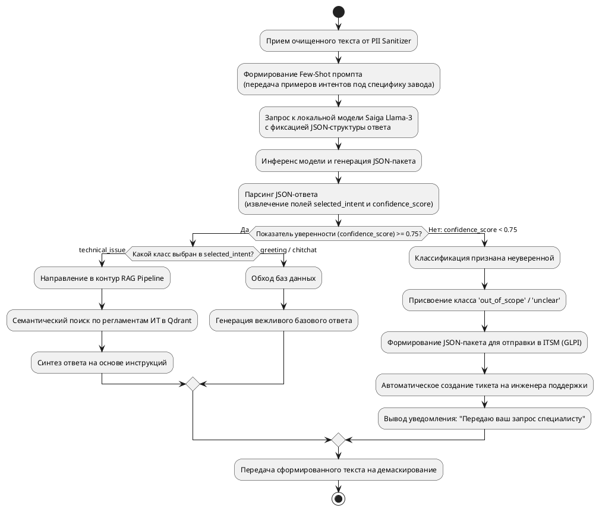
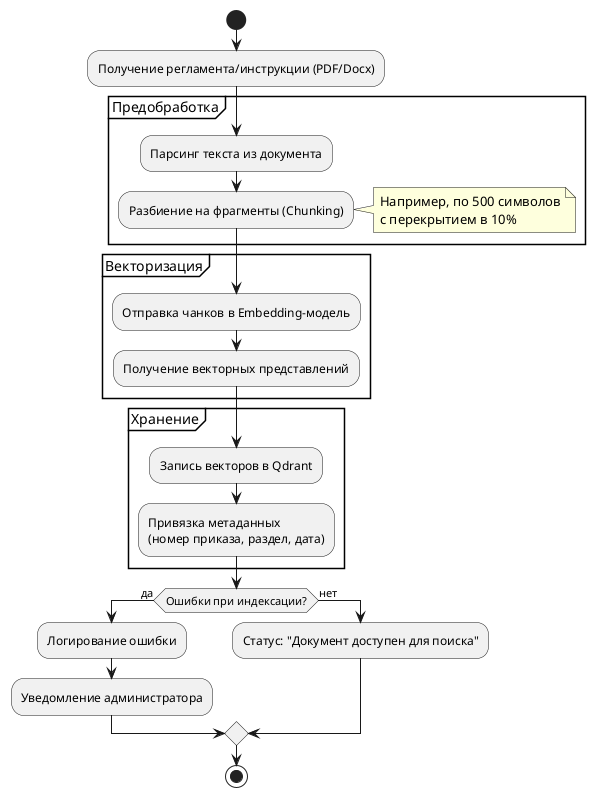
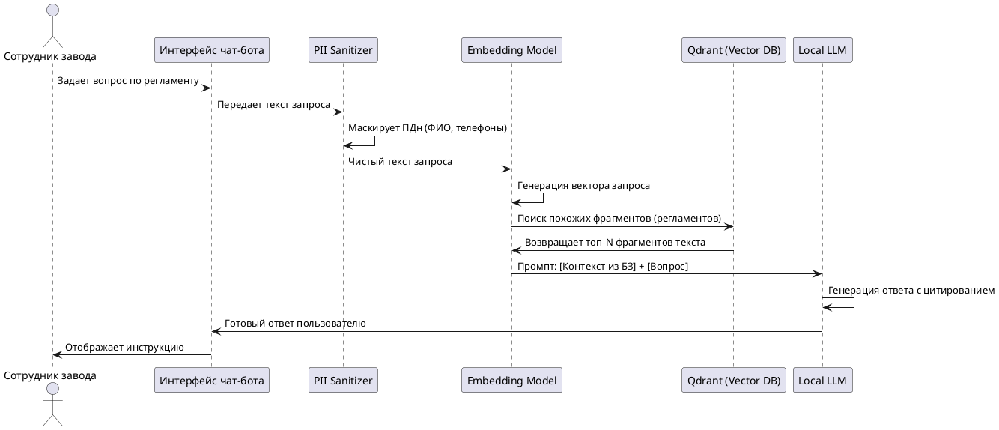

Рис. 1. Концептуальная архитектура обработки запросов в локальном ИИ-ассистенте

Рис. 2. Процесс прохождения высокоуровневого запроса пользователя через фильтры безопасности, классификатор и RAG-контур.

Рис. 3. Алгоритм работы модуля классификации интентов (Intent Router)

Взаимодейстивие с пользователем 

